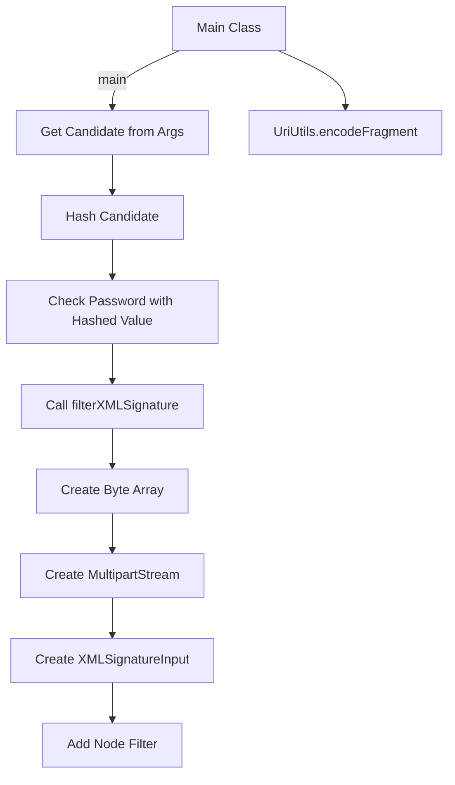

```mermaid
graph TD;
    A[Main Class] -->|main| B[Get Candidate from Args]
    B --> C[Hash Candidate]
    C --> D[Check Password with Hashed Value]
    D --> E[Call filterXMLSignature]
    E --> F[Create Byte Array]
    F --> G[Create MultipartStream]
    G --> H[Create XMLSignatureInput]
    H --> I[Add Node Filter]
    A --> J[UriUtils.encodeFragment]
```
